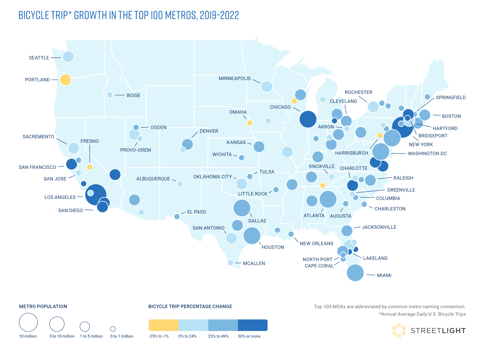
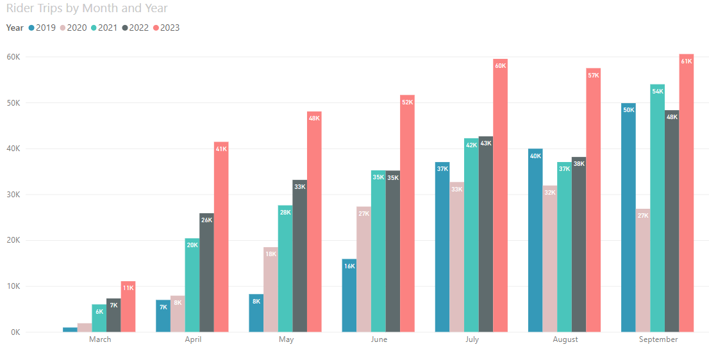

```{r setup, include=FALSE}
knitr::opts_chunk$set(echo = FALSE)
```


Another year of commuting data from the American Community Survey (ACS) was released. This is an opportunity to look at the state of biking in 2022. Last year, I did a [deep dive into the ACS commuting data](https://haraldkliems.netlify.app/posts/latest-commute-mode-share-madison-2021/), as it was the first year that the data was released after the onset of the pandemic. And indeed: Huge changes in commuting, especially an explosion in working from home, could be seen. However, commuting is only one part of our transportation landscape, and this year my review will also look at several other indicators of the state of biking in Madison, as well as making comparisons with some other US cities and national trends.


# Commuting data from ACS: Fewer people work from home; driving and transit usage are up

After an unprecedented rise in working from home between 2019 and 2021, some people returned to the office in 2022. The share of working from home declined from over 26% in 2021 to about 20% in 2021. The two modes with the largest increases were driving (58% to 62%; increase within margin of error) and transit (3% to 5%). All other modes didn't change much at all, and any changes were well within the margins of error. Biking ended up at a miserable 2.6% (+/- 0.7%), the lowest percentage in the data reaching back to 2010.


 

```{r, layout="l-page", fig.width=7, fig.asp = 0.618}
library(tmap)
library(sf)
library(tidycensus)
library(tidyverse)
library(gt)
library(ggtext)
library(extrafont)
library(hrbrthemes)
loadfonts(device = "win", quiet = TRUE) 


# variables <- load_variables(dataset = "acs1/subject", year = "2021")

get_msn_mode_share <- function(year) {
  acs_data <- get_acs(year = year, survey = "acs1", table = "S0801", geography = "place", state = 55, cache_table=T)
  acs_data |> 
    filter(NAME == "Madison city, Wisconsin") |> 
    mutate(year = year)
}


# variable_readable = case_when(
#   variable == "S0801_C01_002" ~ "Drive",
#   variable == "S0801_C01_009" ~ "Transit",
#   variable == "S0801_C01_010" ~ "Walk",
#   variable == "S0801_C01_011" ~ "Bike",
#   variable == "S0801_C01_013" ~ "Work from home",
#   variable == "S0801_C02_002" ~ "Drive, male",
#   variable == "S0801_C02_009" ~ "Transit, male",
#   variable == "S0801_C02_010" ~ "Walk, male",
#   variable == "S0801_C02_011" ~ "Bike, male",
#   variable == "S0801_C02_013" ~ "Work from home, male",
#   variable == "S0801_C03_002" ~ "Drive, female",
#   variable == "S0801_C03_009" ~ "Transit, female",
#   variable == "S0801_C03_010" ~ "Walk, female",
#   variable == "S0801_C03_011" ~ "Bike, female",
#   variable == "S0801_C03_013" ~ "Work from home, female",
#   
#   
# )


msn_mode_share <- map_dfr(c(2010:2019, 2021:2022), get_msn_mode_share)

msn_mode_share <- msn_mode_share |> 
  mutate(gender = case_when(str_detect(variable, "^S0801_C01") ~ "total",
                            str_detect(variable, "^S0801_C02") ~ "male",
                            str_detect(variable, "^S0801_C03") ~ "female"),
         mode_readable = case_when(
           str_detect(variable, "S0801_C0[1-3]_002") ~ "Drive",
           str_detect(variable, "S0801_C0[1-3]_009") ~ "Transit",
           str_detect(variable, "S0801_C0[1-3]_010") ~ "Walk",
           str_detect(variable, "S0801_C0[1-3]_011") ~ "Bike",
           str_detect(variable, "S0801_C0[1-3]_013") ~ "Work from home"))
        
# data frame for the ggrepel labels on the right of the plot
msn_mode_share_2022 <-  msn_mode_share |> 
  filter(year == 2022 & !is.na(mode_readable))

msn_mode_share |> 
  filter(!is.na(mode_readable) & gender == "total") |> 
  group_by(mode_readable, year) |> 
  ggplot(aes(year, estimate, color = mode_readable)) +
  geom_line(linewidth = 1.2) +
  hrbrthemes::scale_color_ipsum(
    #name = element_blank()
    ) +
  geom_crossbar(aes(ymin = estimate - moe, ymax = estimate + moe), alpha = .9,
                  fatten = 1) +
  hrbrthemes::theme_ipsum() +
  scale_x_continuous(breaks = c(2010, 2011, 2012, 2013, 2014, 2015, 2016, 2017, 2018, 2019, 2021, 2022), minor_breaks = NULL, limits = c(2010, 2023.5)) +
  ylab("estimate (%)") +
  labs(title = "Some Madisonians returned to the office in 2022,\nand they did so by car or bus",
       subtitle ="City of Madison commute mode share and margin of error",
       caption = "American Community Survey 1-year estimates, Table S0801\nVisualization: Harald Kliems") +
    ggrepel::geom_text_repel(data = msn_mode_share_2022 |> filter(gender == "total"), aes(label = paste0(mode_readable, " ", estimate, "%")), nudge_x = 1) +
  theme(legend.position = "none")
```

The following chart zooms in on the the changes between 2021 and 2022, which makes it easier to see which changes are beyond the margin of error:

```{r, layout="l-page", fig.width=7, fig.asp = 0.618}
msn_mode_share |> 
  filter(!is.na(mode_readable) & gender == "total" & year >= 2019) |> 
  group_by(mode_readable, year) |> 
  pivot_wider(names_from = year, values_from = c(estimate, moe)) |> 
  mutate(diff_22_21 = estimate_2022-estimate_2021,
         diff_22_21_formatted = paste0(round(diff_22_21,digits = 1), "%")) |>
  ggplot() +
    geom_segment(aes(x=mode_readable, xend=mode_readable, y=estimate_2021, yend=estimate_2022), color="grey", arrow = arrow(length = unit(2, "mm"))) +
  geom_point(aes(x = mode_readable, y = estimate_2021), color = "#d18975") +
    geom_crossbar(aes(mode_readable, estimate_2021, ymin = estimate_2021 - moe_2021, ymax = estimate_2021 + moe_2021), alpha = .6,
                  fatten = 1, color = "#d18975")+
    geom_point(aes(x = mode_readable, y = estimate_2022), color = "#8fd175") +
      geom_crossbar(aes(mode_readable, estimate_2022, ymin = estimate_2022 - moe_2022, ymax = estimate_2022 + moe_2022), alpha = .6,
                  fatten = 1, color = "#8fd175")+
  geom_label(aes(x = mode_readable, 
                y = (estimate_2022 + estimate_2021)/2, 
                label = diff_22_21_formatted),
            nudge_x = .4, label.padding = unit(.1, "lines"))+
  hrbrthemes::scale_color_ipsum(
    #name = element_blank()
    ) +
  hrbrthemes::theme_ipsum() +
  coord_flip() +
  theme(panel.grid.major.y = element_blank()) +
  ylab("estimate (%)") +
  xlab(element_blank()) +
  labs(title = "Working from home is down; transit commutes are up",
       subtitle ="City of Madison, 2021-2022. Boxes show margin of error",
       caption = "American Community Survey 1-year estimates, Table S0801\nVisualization: Harald Kliems") 
```

As always, when talking about ACS data, keep in mind that commuting is defined how the survey respondent "usually" got to work in the past week. Especially now that many workers are in hybrid work arrangements, there is additional uncertainty about the interpretation of the numbers.

# How does Madison compare to US-wide trends?

If we look at change over time, it seems like a good idea to ask whether Madison is following a unique path. The following chart compares the Madison in Madison with that of the US as a whole:

```{r layout="l-page", fig.width=8, fig.asp = 0.618}
get_national_mode_share <- function(year) {
  acs_data <- get_acs(year = year, survey = "acs1", table = "S0801", geography = "us", cache_table=T)
  acs_data |> 
    mutate(year = year)
}


# variable_readable = case_when(
#   variable == "S0801_C01_002" ~ "Drive",
#   variable == "S0801_C01_009" ~ "Transit",
#   variable == "S0801_C01_010" ~ "Walk",
#   variable == "S0801_C01_011" ~ "Bike",
#   variable == "S0801_C01_013" ~ "Work from home",
#   variable == "S0801_C02_002" ~ "Drive, male",
#   variable == "S0801_C02_009" ~ "Transit, male",
#   variable == "S0801_C02_010" ~ "Walk, male",
#   variable == "S0801_C02_011" ~ "Bike, male",
#   variable == "S0801_C02_013" ~ "Work from home, male",
#   variable == "S0801_C03_002" ~ "Drive, female",
#   variable == "S0801_C03_009" ~ "Transit, female",
#   variable == "S0801_C03_010" ~ "Walk, female",
#   variable == "S0801_C03_011" ~ "Bike, female",
#   variable == "S0801_C03_013" ~ "Work from home, female",
#   
#   
# )


national_mode_share <- map_dfr(c(2010:2019, 2021:2022), get_national_mode_share)

national_mode_share <- national_mode_share |> 
  mutate(gender = case_when(str_detect(variable, "^S0801_C01") ~ "total",
                            str_detect(variable, "^S0801_C02") ~ "male",
                            str_detect(variable, "^S0801_C03") ~ "female"),
         mode_readable = case_when(
           str_detect(variable, "S0801_C0[1-3]_002") ~ "Drive",
           str_detect(variable, "S0801_C0[1-3]_009") ~ "Transit",
           str_detect(variable, "S0801_C0[1-3]_010") ~ "Walk",
           str_detect(variable, "S0801_C0[1-3]_011") ~ "Bike",
           str_detect(variable, "S0801_C0[1-3]_013") ~ "Work from home"))
        
# data frame for the ggrepel labels on the right of the plot
national_mode_share_2022 <-  national_mode_share |> 
  filter(year == 2022 & !is.na(mode_readable))

combined <- rbind(national_mode_share |> mutate(location = "national"), msn_mode_share |> mutate(location = "Madison"))
combined_2022 <- rbind(national_mode_share_2022 |> mutate(location = "national"), msn_mode_share_2022 |> mutate(location = "Madison"))

combined |> 
  filter(!is.na(mode_readable) & gender == "total") |> 
  group_by(mode_readable, year, location) |> 
  ggplot(aes(year, estimate, color = mode_readable)) +
  geom_line(size = 1.2) +
  hrbrthemes::scale_color_ipsum(
    #name = element_blank()
    ) +
  # geom_crossbar(aes(ymin = estimate - moe, ymax = estimate + moe), alpha = .9, fatten = 1) +
  hrbrthemes::theme_ipsum() +
  scale_x_continuous(breaks = c(2010, 2015, 2022), limits = c(2010, 2023.5)) +
  ylab("estimate (%)") +
  labs(title = "Mode share trends in Madison follow\na similar pattern as the national numbers",
       subtitle ="City of Madison and US commute mode share, 2010-2022",
       caption = "American Community Survey 1-year estimates, Table S0801\nVisualization: Harald Kliems") +
    ggrepel::geom_text_repel(data = combined_2022 |> filter(gender == "total"), aes(label = paste0(mode_readable, " ", estimate, "%")), nudge_x = 1) +
  # theme(legend.position = "none", plot.title = element_text(lineheight = .5, margin = margin(b = 0.5)), plot.subtitle = element_text(margin = margin(t = 0))) +
  facet_wrap(~location) +
  theme(legend.position = "none")
```
A similar pattern emerges. While Madison commuters drive less, bike, walk, and bus more than the average US commuter, the trend over time looks similar. And that's true for the change from 2021 to 2022 as well: Just like in Madison, nationwide working from home went down, and driving and transit rebounded slightly. 

# How are other cities doing?
Rather than comparing Madison with the US as whole, we can also compare our 2022 numbers with other US cities. Here we see a lot of variability, but when it comes to biking, other places aren't doing much better. San Francisco and Portland have marginally higher bike commuting rates, and Minneapolis is a little lower than Madison,  but they all are within the margin error. New York City is below 2%, and in Milwaukee not even 1 out of 100 workers bike to work.

```{r layout="l-page", fig.width=7, fig.asp = 0.618}


get_place_mode_share <- function(year, places) {
  acs_data <- get_acs(year = year, survey = "acs1", table = "S0801", geography = "place", cache_table=T)
  acs_data |> 
    filter(NAME %in% places) |> 
    mutate(year = year)
}

national_mode_share_2022_total <- national_mode_share_2022 %>% 
  filter(gender == "total") %>% 
  mutate(
    label = case_when(
           mode_readable == "Drive" ~ "<span style='font-family:fa-solid;'>&#xf1b9;</span>",
           mode_readable == "Transit" ~ "<span style='font-family:fa-solid;'>&#xf207;</span>",
           mode_readable == "Walk" ~ "<span style='font-family:fa-solid;'>&#xf554;</span>",
           mode_readable == "Bike" ~ "<span style='font-family:fa-solid;'>&#xf206;</span>",
           mode_readable == "Work from home" ~ "<span style='font-family:fa-solid;'>&#xe066;</span>"
  ),
  NAME = "US")

mode_share_comparison <- get_place_mode_share(2022, c("Madison city, Wisconsin", "Portland city, Oregon", "Minneapolis city, Minnesota", "San Francisco city, California", "Milwaukee city, Wisconsin", "New York city, New York"))

mode_share_comparison <- mode_share_comparison |> 
  mutate(gender = case_when(str_detect(variable, "^S0801_C01") ~ "total",
                            str_detect(variable, "^S0801_C02") ~ "male",
                            str_detect(variable, "^S0801_C03") ~ "female"),
         mode_readable = case_when(
           str_detect(variable, "S0801_C0[1-3]_002") ~ "Drive",
           str_detect(variable, "S0801_C0[1-3]_009") ~ "Transit",
           str_detect(variable, "S0801_C0[1-3]_010") ~ "Walk",
           str_detect(variable, "S0801_C0[1-3]_011") ~ "Bike",
           str_detect(variable, "S0801_C0[1-3]_013") ~ "Work from home"),
         label = case_when(
           mode_readable == "Drive" ~ "<span style='font-family:fa-solid;'>&#xf1b9;</span>",
           mode_readable == "Transit" ~ "<span style='font-family:fa-solid;'>&#xf207;</span>",
           mode_readable == "Walk" ~ "<span style='font-family:fa-solid;'>&#xf554;</span>",
           mode_readable == "Bike" ~ "<span style='font-family:fa-solid;'>&#xf206;</span>",
           mode_readable == "Work from home" ~ "<span style='font-family:fa-solid;'>&#xe066;</span>"
         ),
         NAME = str_remove(NAME, " city")) |> 
    filter(!is.na(mode_readable) & gender == "total")

```

```{r layout="l-page", fig.width=5, fig.asp = 0.618}
library(showtext)

showtext_auto()
# First argument = name in R
# Second argument = path to .otf-file
font_add('fa-reg', 'fonts/Font_Awesome_6_Free-Regular-400.otf')
font_add('fa-brands', 'fonts/Font_Awesome_6_Brands-Regular-400.otf')
font_add('fa-solid', 'fonts/Font_Awesome_6_Free-Solid-900.otf')
font_add("Arial Narrow", "C:/Windows/Fonts/ARIALN.TTF")
font_add_google("Roboto Condensed", "Roboto Condensed")

p <- rbind(mode_share_comparison, national_mode_share_2022_total) %>% 
  mutate(name_by_bike_share = fct_relevel(NAME, c("San Francisco, California", 
                        "Portland, Oregon",
                        "Madison, Wisconsin", 
                        "Minneapolis, Minnesota", 
                        "New York, New York",
                        "Milwaukee, Wisconsin",
                        "US"))) %>% 
  group_by(mode_readable, name_by_bike_share) |> 
  ggplot(aes(name_by_bike_share, estimate, color = mode_readable, label = label)) +
    geom_richtext(size = 8, label.colour = NA, fill = NA) +
    geom_point(size = 2, color = "red") +
  hrbrthemes::scale_color_ipsum() +
  scale_fill_discrete() +
  hrbrthemes::theme_ipsum() +
  # scale_x_continuous(breaks = c(2010, 2011, 2012, 2013, 2014, 2015, 2016, 2017, 2018, 2019, 2021, 2022), minor_breaks = NULL, limits = c(2010, 2023.5)) +
  ylab("estimate (%)") +
  xlab(element_blank()) +
  labs(title = "2022 Commute mode share",
       subtitle = "Madison and select US cities",
       caption = "American Community Survey 1-year estimates, Table S0801\nVisualization: Harald Kliems") +
    # ggrepel::geom_text_repel(data = combined_2022 |> filter(gender == "total"), aes(label = paste0(mode_readable, " ", estimate, "%")), nudge_x = 1) +
  theme(legend.position = "none",
        panel.grid.major.y = element_blank()) +
  coord_flip() +
  theme(plot.title = element_text(lineheight = .5, margin = margin(b = .5)), plot.subtitle = element_text(margin = margin (t = 0)), plot.caption = element_text(lineheight = .5))
  # facet_wrap(~NAME)
p

```

# Counter data 2022

Commuting data from the American Community Survey is only part of the picture. Another indicator of the state of biking comes from the city's two permanent visual bike counters. These are located on the Southwest Path near Camp Randall and on the Cap City Trail at the intersection of John Nolen and North Shore. Rather than only counting commutes, these counters capture all bike trips. 

```{r layout="l-page", fig.width=8, fig.asp = 0.618}
showtext.auto(enable = FALSE)
detach("package:showtext", unload = TRUE)
counts_2022 <- readxl::read_excel("data/EcoCounter_2022.xlsx", skip = 3,
                   col_names = c("time_count", "count_cap_city", "count_sw_path")) |> 
  mutate(date_count = floor_date(time_count, unit = "hours")) |> 
  summarize(across(starts_with("count_"), ~ sum(.x, na.rm = T)), .by = date_count) |> 
  pivot_longer(cols = starts_with("count_"), names_to = "location", values_to = "count_hourly") |> 
  mutate(location = case_when(location == "count_cap_city" ~ "Cap City at North Shore",
                              location == "count_sw_path" ~ "SW Path at Randall"),
         dayofweek = wday(date_count),
         weekendind = ifelse(dayofweek %in% c(1:5), "weekday", "weekend"),
         month_count = month(date_count, label = T, abbr = T)) 


# code reused from https://github.com/vgXhc/madison_bike_counts/blob/master/analysis.R

##get bike counter data
cc_counts <- read_csv("data/Eco-Totem_Capital_City_Trail_Bike_Counts(3).csv", col_types = "ci-") %>% mutate(location = "Cap City at North Shore")
sw_counts <- read_csv("data/Eco-Totem_Southwest_Path_Bike_Counts(2).csv", col_types = "ci-") %>% mutate(location = "SW Path at Randall")
#combine two counter locations
counts <- bind_rows(cc_counts, sw_counts)
#some data prep for counts
counts2 <- counts %>% 
  drop_na %>% 
  mutate(date_count = mdy_hm(Count_Date), #fix date and time
         location = as.factor(location),
         # Count = ifelse(Count == 0, 1, Count), #convert 0 counts to 1 to allow log transform
         # log_count = log(Count), #create value for log of count
         dayofweek = wday(date_count),
         weekendind = ifelse(dayofweek %in% c(1:5), "weekday", "weekend"),
         month_count = month(date_count, label = T, abbr = T)
         ) |> 
  select(-Count_Date) |> 
  rename(count_hourly = Count) |> 
  filter(date_count < ymd_hms("2022-01-01 00:00:00"))


rbind(counts2, counts_2022) |> 
  mutate(year_count = year(date_count)) |> 
  filter(year_count >= 2016) |> 
  summarize(count_annual_by_location = sum(count_hourly), .by = c(location, year_count)) |>
  reframe(location, year_count, count_annual_by_location, count_annual = sum(count_annual_by_location), .by = year_count) |> 
  ggplot(aes(year_count, count_annual_by_location, fill = location)) +
  geom_col(position = "stack") +
  geom_text(
    aes(label = after_stat(y), group = year_count), 
    stat = 'summary', fun = sum, vjust = -.3, family = "Roboto Condensed"
  ) +
  ylim(c(0, 1050000)) +
  scale_fill_ipsum(name = "Location") +
  hrbrthemes::theme_ipsum() +
  ylab("Number of cyclists") +
  xlab("Year") +
  labs(title = "Bike counts declined by 24% between 2016 and 2022",
       subtitle = "Counts at permanent Eco Counter locations",
       caption = "Data: City of Madison\nVisualization: Harald Kliems") +
  theme(legend.position = "right")
```

These counts don't paint a rosy picture for biking either. Since the counters were installed, they have counted fewer and fewer people on bikes. While in 2016 we had almost one million counts, by 2022 that number has declined to less than 750,000.

# Streetlight data
The American Community Survey only counts commutes; the Eco Counters only count at two locations. Streetlight, a private company, promises to provide comprehensive counts for the whole metro area. They do this by using cell phone and other location data and applying various machine learning mechanisms to estimate bike trips. The data and algorithms are proprietary, and research published by Streetlight claims a high correlation between their data and validation counts from permanent bike counters.

In a recently released report, Streetlight [compares 100 US metro areas](https://learn.streetlightdata.com/ranking-us-bicycle-count-trends)^[Streelight appears to use metropolitan statistical areas. It's important to note that these are much larger than what most people imagine a metro area to be. In the case of Madison, the area [encompasses Dane, Columbia, Green and Iowa counties](https://en.wikipedia.org/wiki/Madison_metropolitan_area,_Wisconsin).] and how cycling activity has changed there compared to 2019, and then between 2020 and 2022. The idea is that during the COVID pandemic many US cities saw a surge in cycling, and now we have an opportunity to see if that surge was sustainable. In terms of growth from 2019 to 2020, the Madison metro area did _not_ see a surge: We ranked 86th out of 100 metro areas in terms of growth. And from 2020 to 2022, Madison fell even further, to 98th place, ahead only of Portland, OR, and Fresno, CA. 

Here's the map showing the change in cycling activity between 2019 and 2022. You can see how Madison (unlabeled on the map) is one of the few metro areas that actually saw a decline during this time period. 



# A single sign of optimism? BCycle ridership
So far all we have seen is doom and gloom. Are there any signs for optimism? Yes: The one indicator that has seen growth in the past few years is use of Madison's bike share system [BCycle](https://madison.bcycle.com/). I don't have complete ridership stats over the years, by Madison BCycle shared this graph of March to September ridership over the past 5 years.^[The BCycle system is open from mid-March to mid-December.]

 

Adding up the numbers shows a 3.6% growth from 222,000 trips in 2021 to 230,000 trips in 2022 during the March to September time period. Of course the more exciting part of this graph is the growth in 2023, but hey, this post is about 2022.

# Where does this leave us?
I don't like it, but it appears that the conclusion for 2022 has to be that it was another lost year for biking in Madison. Yes, compared to most other US cities, there is still a lot of biking, but for many years we have lacked any growth and likely have seen a decline in how many people ride their bikes and how often they do it. This post doesn't go into possible explanations, but that work needs to be done in order to figure out how we can turn this trend around.


